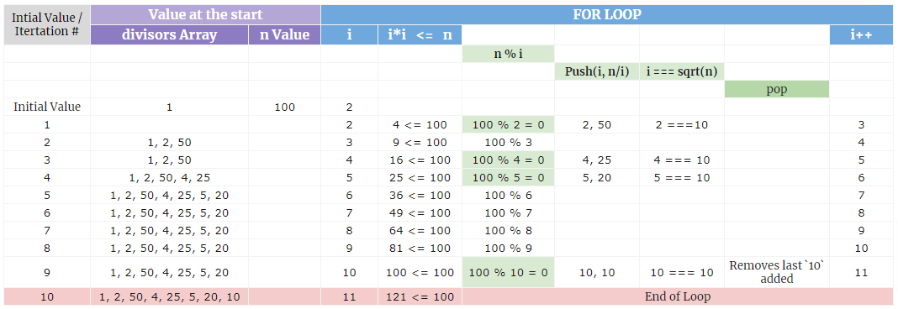

# Proper Divisors

## Problem
Find Proper Divisors of the Positive integer number `n`.

## Approach
We can approach this in two ways. 
- Brute force method
- Squareroot of `n` method

### Brute force method:
The most basic approach is to apply the brute force method which solves a problem through exhaustion - it goes through all possible choices until a solution is found.

To find the divisors for a positive integer `n`, we just iterate all the integers from `1, 2, 3, . . . , n`, and divide `n` by each of those integers `i`, and those that divide evenly make up the set of divisors for `n`. 

This is rather plain, easy and a simple but is not quite efficient solution. 

The time complexity to find divisors of `n` is `O(n)`.

Consider that we need to find the divisors of a number `100000`.
Then using this brute force method, we need to divide `100000` from `1 to 100000` taking `100000` iterations. This would take a long time to compute all the divisors of `100000`.

Hence it is recommended to use more efficient solution like that of `Squareroot of n method`

### Squareroot of `n` method:
Let us observe the divisors of `100` first. 

The proper divisors of `100` are `1, 2, 4, 5, 10, 20, 25, 50` which can be written as `1, 2, 4, 5, 10, 100/5, 100/4, 100/2`.

If `i` is a divisor of `n`, then `d = n/i` is also a divisor of `n` because `i * d = n`. Hence the divisors can be organised into pairs of `(i, n/i)`. The exception for this is if `n` is a perfect square and `i = sqrt(n)`, then in this case both `i` and `d` is equal.

Thus the divisors of a number `n` usually appears in pairs and using this method, the time complexity is `O(sqrt(n))`

Example of finding divisors of `n = 100` 
